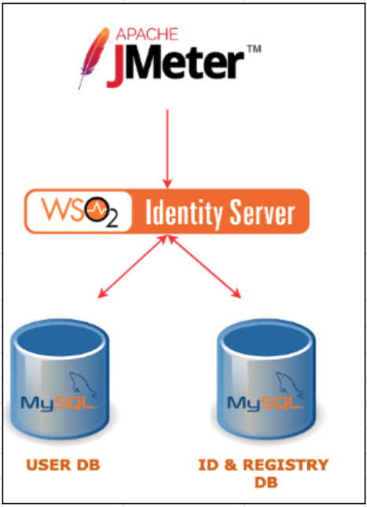
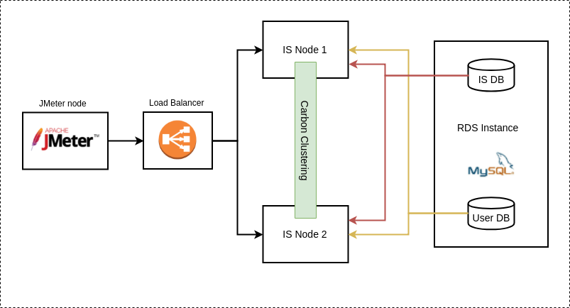

# WSO2 Identity Server Performance

WSO2 Identity Server performance artifacts are used to continuously test the performance of the Identity Server.

These performance test scripts make use of the Apache JMeter to run the tests with different concurrent users and different Identity Server version.

The deployment is automated using AWS cloud formation. 

Artifacts in the master branch can be used with the WSO2 Identity Server version 5.10.0.For previous versions, please use below branches
 1. [is-5.9.0](https://github.com/wso2/performance-is/tree/is-5.9.0) for product version 5.9.0
 2. [is-5.8.0](https://github.com/wso2/performance-is/tree/is-5.8.0) for product version 5.8.0 to 5.6.0
 
## About the deployment

At the moment we support for two deployment patterns as,
1. Single node deployment.
  - 

2. Two node cluster deployment.
  - 

WSO2 Identity Server is setup in an AWS EC2 instance. AWS RDS instance is used to host the MySQL user store and identity databases.

JMeter version 3.3 is installed in a separate node which is used to run the test scripts and gather results from the setup.

## Run Performance Tests

You can run IS Performance Tests from the source using the following instructions.

### Prerequisites

* [Maven 3.5.0 or later](https://maven.apache.org/download.cgi)
* [AWS CLI](https://aws.amazon.com/cli/) - Please make sure to [configure the AWS CLI](https://docs.aws.amazon.com/cli/latest/userguide/cli-chap-getting-started.html) and set the output format to `json`.
* [Apache JMeter 3.3](https://jmeter.apache.org/) Setup tarball.
* WSO2 IS server zip file.
* Python 3.5
    * [Jinja2 2.11.1](https://pypi.org/project/Jinja2/)
    * numpy

### Steps to run performance tests.

1. Clone this repository.

```console
git clone https://github.com/wso2/performance-is
```
2. Checkout master branch for the latest Identity Server version or relevant version tag for previous releases.
```console
cd performance-is
git checkout v5.8.0
```
3. Build the artifacts using Maven.
```console
mvn clean install
```

4. Based on your preferred deployment, navigate to `single-node` directory or `two-node-cluster` directory.
4. Run the `start-performance.sh` script. It will take around 15 hours to complete the test round with default settings. Therefore, you might want to use `nohup`. Following is the basic command.
```console
./start-performance.sh -k is-perf-test.pem -a ******* -s ******* -c is-perf-cert -n wso2IS.zip -j apache-jmeter-3.3.tgz -- -d 10 -w 2
```

See usage:

```console
./start-performance.sh -k <key_file> -a <aws_access_key> -s <aws_access_secret>
   -c <certificate_name> -j <jmeter_setup_path>
   [-n <IS_zip_file_path>]
   [-u <db_username>] [-p <db_password>]
   [-i <wso2_is_instance_type>] [-b <bastion_instance_type>]
   [-w <minimum_stack_creation_wait_time>] [-h]

-k: The Amazon EC2 key file to be used to access the instances.
-a: The AWS access key.
-s: The AWS access secret.
-j: The path to JMeter setup.
-c: The name of the IAM certificate.
-n: The is server zip
-u: The database username. Default: wso2carbon.
-p: The database password. Default: wso2carbon.
-i: The instance type used for IS nodes. Default: c5.xlarge.
-b: The instance type used for the bastion node. Default: c6i.large.
-w: The minimum time to wait in minutes before polling for cloudformation stack's CREATE_COMPLETE status.
    Default: 10 minutes.
-h: Display this help and exit.
```

### What does the script do?
1. Validate the CloudFormation template with given parameters, using the AWS CLI.
2. Run the CloudFormation template to creat the deployment and wait till the stack creation completes.
3. Extract the following using the AWS CLI.
   * Bastion node public IP. (Used as the JMeter client)
   * Private IP of the WSO2 IS instance.
   * RDS instance hostname.
4. Setup the wso2 IS server in the instance and create the databases.
5. Copy required files such as the key file, performance artifacts and the JMeter setup to the bastion node.
6. SSH into the bastion node and execute the [setup-bastion.sh](single-node/setup/README.md) script, which will setup the additional components in the deployment.
7. SSH into the bastion node and execute the [run-performance-test.sh](common/jmeter/README.md) script, which will run the tests and collect the results.
8. Download the test results from the bastion node.
9. Create summary CSV file and MD file.

## Performance Analysis Graphs

We have added a performance analysis feature to the project, which allows you to generate performance plots based on CSV data files. This feature provides insights into response times for different deployment types and scenarios. By analyzing these performance plots, you can identify performance bottlenecks and make informed optimizations.

To use this feature, we have added the `performance_plots.py` script to the project. This script reads CSV data files, filters the data based on concurrency ranges, and generates performance plots using the matplotlib library. The generated plots are saved in the 'output' folder.

Additionally, we have updated the README.md file in the `performance_analysis` directory to provide detailed instructions on how to use the script, customize the settings, and understand the input CSV data format.

To get started with the performance analysis feature, please refer to the [performance_analysis/README.md](performance_analysis/README.md) file for instructions and examples.

## Legacy Mode

If needed to run the performance test in legacy mode, please use the legacy-mode branch.
Legacy mode will include single node and 2 node setup deployments with previous test flows.
