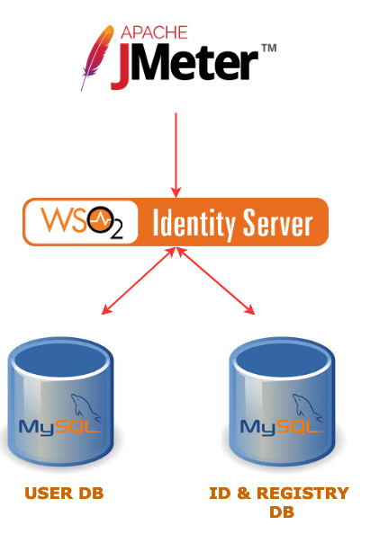

# WSO2 Identity Server Performance

WSO2 Identity Server performance artifacts are used to continuously test the performance of the Identity Server.

These performance test scripts make use of the Apache JMeter to run the tests with different cocurrent users and different IS servers

The delpoyment is automated using AWS cloud formation. 

## About the deployment

Below diagram shows the deployment architecture of the setup used by these artifacts. WSO2 IS server is setup in a EC2 instance. AWS RDS instance is used to host the MySQL user store and identity databases.

JMeter version 3.3 is installed in a separate node which is used to run the test scripts and gather results from the clustered identity server setup.



## Run Performance Tests

You can run IS Performance Tests from the source using the following instructions.

### Prerequisites

* [Maven 3.5.0 or later](https://maven.apache.org/download.cgi)
* [AWS CLI](https://aws.amazon.com/cli/) - Please make sure to [configure the AWS CLI](https://docs.aws.amazon.com/cli/latest/userguide/cli-chap-getting-started.html) and set the output format to `json`.
* [Apache JMeter 3.3](https://jmeter.apache.org/) Setup tarball.
* WSO2 IS server zip file
* Python and [Jinja2](http://jinja.pocoo.org/docs/2.10/)

### Steps to run performance tests.

1. Clone this repository.

```
git clone https://github.com/wso2/performance-is
```
2. Checkout to single-node-performance branch
```
git checkout single-node-performance
```
3. Build the artifacts using Maven.
```
mvn clean install
```

4. Change directory to `cloudformation/` and run the `start_performance_single.sh` script. Following is the basic command.
```
./start_performance_single.sh -k is-perf-test.pem -a ******* -s ******* -c is-perf-cert -n wso2IS.zip -j apache-jmeter-4.0.tgz -- -d 10 -w 2
```

See usage:

```
./start_performance_single.sh -k <key_file> 
   -a <aws_access_key> -s <aws_access_secret>
   -c <certificate_name> -j <jmeter_setup_path>
   [-n <IS_zip_file_path>]
   [-u <db_username>] [-p <db_password>]
   [-i <wso2_is_instance_type>] [-b <bastion_instance_type>]
   [-w <minimum_stack_creation_wait_time>] [-h]
   -- [run_performance_tests_options]

-k: The Amazon EC2 key file to be used to access the instances.
-a: The AWS access key.
-s: The AWS access secret.
-j: The path to JMeter setup.
-c: The name of the IAM certificate.
-n: The is server zip.
-u: The database username. Default: wso2carbon.
-p: The database password. Default: wso2carbon.
-i: The instance type used for IS nodes. Default: c5.large.
-b: The instance type used for the bastion node. Default: m4.large.
-w: The minimum time to wait in minutes before polling for cloudformation stack's CREATE_COMPLETE status.
    Default: 10 minutes.
-h: Display this help and exit.
```

### What does the script do?
1. Validate the CloudFormation template with given parameters, using the AWS CLI.
2. Run the CloudFormation template and creat the deployment, wait till the stack creation completes.
3. Extract the following using the AWS CLI.
   * Bastion node public IP. (Used as the JMeter client)
   * Private IP of the WSO2 IS instance.
   * RDS instance hostname.
4. Setup the wso2 IS server in the instance and create the databases
5. Copy `setup-bastion.sh`, key file, is-performance-distribution-*.tar and the JMeter setup to bastion node.
6. SSH into the bastion node and execute the copied [setup-bastion.sh](distribution/scripts/setup) script, which will setup the additional components in the deployment.
7. SSH into the bastion node and execute the [run-performance-test.sh](distribution/scripts/jmeter) script, which will run the test and collect the results.
8. Download the test results from the bastion node.

