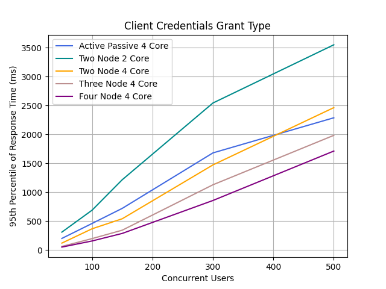
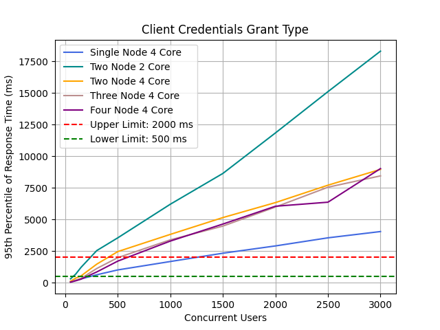
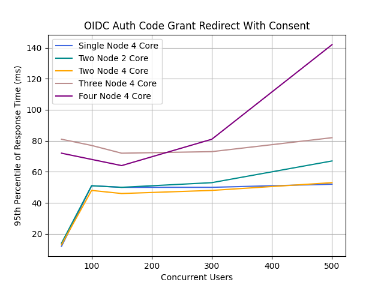
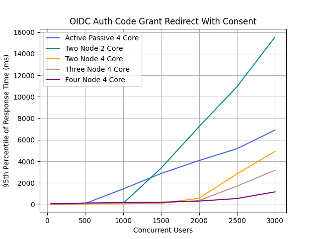
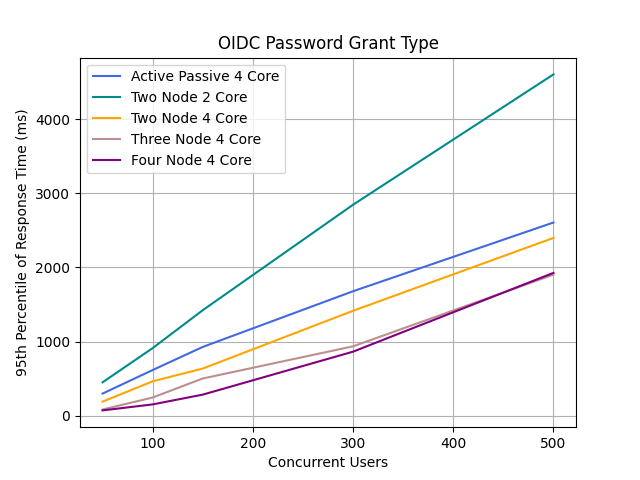
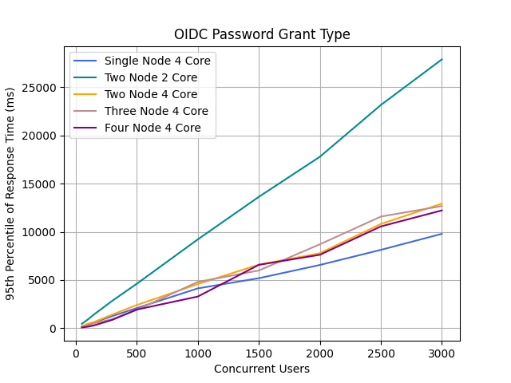
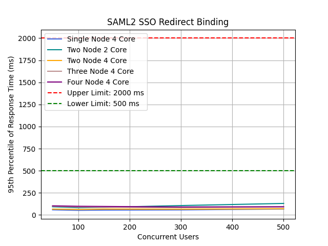
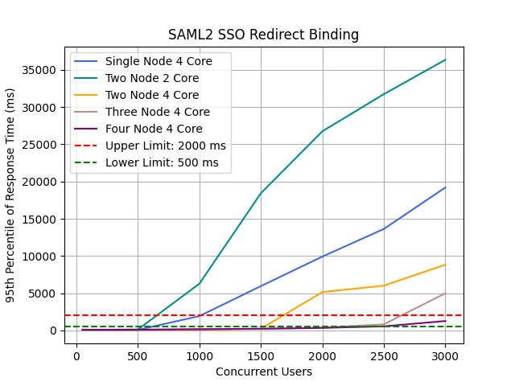

# IAM Performance Test Results Comparison

During each release, we execute various automated performance test scenarios and publish the results.

| Test Scenarios | Description |
| --- | --- |
| Client Credentials Grant Type | Obtain an access token using the OAuth 2.0 client credential grant type. |
| OIDC Auth Code Grant Redirect With Consent | Obtain an access token and an id token using the OAuth 2.0 authorization code grant type. |
| OIDC Password Grant Type | Obtain an access token and an id token using the OAuth 2.0 password grant type. |
| SAML2 SSO Redirect Binding | Obtain a SAML 2 assertion response using redirect binding. |

Our test client is [Apache JMeter](https://jmeter.apache.org/index.html). We test each scenario for a fixed duration of
time and split the test results into warm-up and measurement parts and use the measurement part to compute the
performance metrics. For this particular instance, the duration of each test is **15 minutes** and the warm-up period is **5 minutes**.

We run the performance tests under different numbers of concurrent users and heap sizes to gain a better understanding on how the server reacts to different loads.

The main performance metrics:

1. **Throughput**: The number of requests that the WSO2 Identity Server processes during a specific time interval (e.g. per second).
2. **Response Time**: The end-to-end latency for a given operation of the WSO2 Identity Server. The complete distribution of response times was recorded.

In addition to the above metrics, we measure the load average and several memory-related metrics.

The following are the test parameters.

| Test Parameter | Description | Values |
| --- | --- | --- |
| Scenario Name | The name of the test scenario. | Refer to the above table. |
| Heap Size | The amount of memory allocated to the application | 2G |
| Concurrent Users | The number of users accessing the application at the same time. | 50, 100, 150, 300, 500, 1000, 1500, 2000, 2500, 3000 |
| IS Instance Type | The AWS instance type used to run the Identity Server. | [**c5.xlarge**](https://aws.amazon.com/ec2/instance-types/) |
| JDK version | The JDK version used to run the Identity Server. | JDK 11.0.15.1  |

In order to ease cross-comparison with earlier versions of the product, the newly introduced features/improvements are disabled when taking these performance results.

```
[authentication_policy]
disable_account_lock_handler=true

[identity_mgt.events.schemes.WorkflowPendingUserAuthnHandler]
subscriptions=[]

[authorization_manager.properties]
GroupAndRoleSeparationEnabled=false
```

The following are the measurements collected from each performance test conducted for a given combination of
test parameters.

| Measurement | Description |
| --- | --- |
| Error % | Percentage of requests with errors |
| Average Response Time (ms) | The average response time of a set of results |
| Standard Deviation of Response Time (ms) | The Standard Deviation of the response time. |
| 99th Percentile of Response Time (ms) | 99% of the requests took no more than this time. The remaining samples took at least as long as this |
| Throughput (Requests/sec) | The throughput measured in requests per second. |
| Average Memory Footprint After Full GC (M) | The average memory consumed by the application after a full garbage collection event. |

The following is the summary of performance test results collected for the measurement period.


### 1. Client Credentials Grant Type

#### Obtain an access token using the OAuth 2.0 client credential grant type.

Performance Comparison of Different Node Configurations with 95th Percentile of Response Time (ms)

| Concurrent Users | Single Node 4 Core | Two Node 2 Core | Two Node 4 Core | Three Node 4 Core | Four Node 4 Core |
|---|---:|---:|---:|---:|---:|
| 50 | 88 | 307 | 117 | 59 | 48 |
| 100 | 192 | 687 | 365 | 195 | 154 |
| 150 | 307 | 1215 | 539 | 341 | 285 |
| 300 | 631 | 2543 | 1471 | 1127 | 855 |
| 500 | 1015 | 3551 | 2463 | 1983 | 1711 |
| 1000 | 1679 | 6207 | 3823 | 3391 | 3295 |
| 1500 | 2335 | 8639 | 5151 | 4479 | 4639 |
| 2000 | 2911 | 11839 | 6335 | 5983 | 6047 |
| 2500 | 3551 | 15103 | 7711 | 7551 | 6367 |
| 3000 | 4047 | 18303 | 8959 | 8447 | 9023 |

<ins> Concurrency: 50 - 500 </ins>



<ins> Concurrency: 50 - 3000 </ins>



### 2. OIDC Auth Code Grant Redirect With Consent

#### Obtain an access token and an id token using the OAuth 2.0 authorization code grant type.

Note: Response time is calculated only for the common-auth login HTTP request path.

Performance Comparison of Different Node Configurations with 95th Percentile of Response Time (ms)

| Concurrent Users | Single Node 4 Core | Two Node 2 Core | Two Node 4 Core | Three Node 4 Core | Four Node 4 Core |
|---|---:|---:|---:|---:|---:|
| 50 | 12 | 14 | 13 | 81 | 72 |
| 100 | 51 | 51 | 48 | 77 | 68 |
| 150 | 50 | 50 | 46 | 72 | 64 |
| 300 | 50 | 53 | 48 | 73 | 81 |
| 500 | 52 | 67 | 53 | 82 | 142 |
| 1000 | 56 | 110 | 60 | 95 | 176 |
| 1500 | 118 | 3375 | 105 | 163 | 214 |
| 2000 | 1807 | 7231 | 583 | 363 | 317 |
| 2500 | 2703 | 10943 | 2847 | 1711 | 555 |
| 3000 | 3679 | 15551 | 4927 | 3183 | 1175 |

<ins> Concurrency: 50 - 500 </ins>



<ins> Concurrency: 50 - 3000 </ins>



### 3. OIDC Password Grant Type

#### Obtain an access token and an id token using the OAuth 2.0 password grant type.

Performance Comparison of Different Node Configurations with 95th Percentile of Response Time (ms)

| Concurrent Users | Single Node 4 Core | Two Node 2 Core | Two Node 4 Core | Three Node 4 Core | Four Node 4 Core |
|---|---:|---:|---:|---:|---:|
| 50 | 176 | 449 | 188 | 82 | 70 |
| 100 | 391 | 911 | 463 | 244 | 151 |
| 150 | 599 | 1423 | 635 | 501 | 283 |
| 300 | 1255 | 2847 | 1415 | 935 | 863 |
| 500 | 2079 | 4607 | 2399 | 1903 | 1927 |
| 1000 | 4127 | 9215 | 4575 | 4799 | 3279 |
| 1500 | 5183 | 13631 | 6591 | 5983 | 6571 |
| 2000 | 6559 | 17791 | 7775 | 8703 | 7615 |
| 2500 | 8127 | 23167 | 10815 | 11583 | 10559 |
| 3000 | 9791 | 27903 | 12927 | 12671 | 12223 |

<ins> Concurrency: 50 - 500 </ins>



<ins> Concurrency: 50 - 3000 </ins>



### 4. SAML2 SSO Redirect Binding

#### Obtain a SAML 2 assertion response using redirect binding.

Note: Response time is calculated only for the identity provider login path.

Performance Comparison of Different Node Configurations with 95th Percentile of Response Time (ms)

| Concurrent Users | Single Node 4 Core | Two Node 2 Core | Two Node 4 Core | Three Node 4 Core | Four Node 4 Core |
|---|---:|---:|---:|---:|---:|
| 50 | 58 | 92 | 66 | 98 | 103 |
| 100 | 52 | 82 | 62 | 90 | 98 |
| 150 | 55 | 86 | 66 | 86 | 96 |
| 300 | 57 | 106 | 65 | 83 | 90 |
| 500 | 67 | 130 | 70 | 89 | 93 |
| 1000 | 1927 | 6271 | 95 | 172 | 161 |
| 1500 | 5951 | 18431 | 220 | 219 | 222 |
| 2000 | 9919 | 26751 | 5151 | 361 | 341 |
| 2500 | 13631 | 31743 | 6015 | 819 | 547 |
| 3000 | 19199 | 36351 | 8831 | 4991 | 1263 |

<ins> Concurrency: 50 - 500 </ins>



<ins> Concurrency: 50 - 3000 </ins>


