# IAM Performance Test Results Comparison

During each release, we execute various automated performance test scenarios and publish the results.
This document will be helpful for capacity planning as it reflects realistic user scenarios.

| Test Scenarios                                                                                            | Description                                                                                                                                                                                                                     |
|-----------------------------------------------------------------------------------------------------------|---------------------------------------------------------------------------------------------------------------------------------------------------------------------------------------------------------------------------------|
| OIDC Auth Code Grant Redirect With Consent                                                                | Obtain an access token and an id token using the OAuth 2.0 authorization code grant type.                                                                                                                                       |
| OIDC Auth Code Grant Redirect Without Consent                                                             | Obtain an access token and an id token using the OAuth 2.0 authorization code grant type without consent.                                                                                                                       |
| OIDC Auth Code Grant Redirect Without Consent Retrieving User Attributes                                  | Obtain an access token and an id token using the OAuth 2.0 authorization code grant type without consent. Retrieve country, email, first name and last name as user attributes.                                                 |
| OIDC Auth Code Grant Redirect Without Consent Retrieving User Attributes, Groups and Roles                | Obtain an access token and an id token using the OAuth 2.0 authorization code grant type without consent. Retrieve country, email, first name and last name as user attributes. Additionally retrieve groups and roles as well. |
| SAML2 SSO Redirect Binding                                                                                | Obtain a SAML 2 assertion response using redirect binding.                                                                                                                                                                      |
| App Native Authentication                                                                                 | Obtain an access token and an id token using the app native authentication.                                                                                                                                                     |
| B2B OIDC Auth Code Grant Redirect With Consent                                                            | Obtain an access token and an id token in b2b flow.                                                                                                                                                                             |
| Token Exchange Grant Type                                                                                 | Obtain an access token and an id token using the token exchange grant type.                                                                                                                                                     |
| Client Credentials Grant Type                                                                             | Obtain an access token using the OAuth 2.0 client credential grant type.                                                                                                                                                        |
| OIDC Password Grant Type                                                                                  | Obtain an access token and an id token using the OAuth 2.0 password grant type.                                                                                                                                                 |

Our test client is [Apache JMeter](https://jmeter.apache.org/index.html). We test each scenario for a fixed duration of
time and split the test results into warm-up and measurement parts and use the measurement part to compute the
performance metrics. For this particular instance, the duration of each test is **15 minutes** and the warm-up period is **5 minutes**.

We run the performance tests under different numbers of concurrent users and heap sizes to gain a better understanding on how the server reacts to different loads.

The main performance metrics:

1. **Response Time**: The end-to-end latency for a given operation of the WSO2 Identity Server. The complete distribution of response times was recorded.

The following are the test specifications.

| Test Specification                | Description                                                          | Values |
|-----------------------------------|----------------------------------------------------------------------|--------|
| No of Users                       | The number of users created for the test cases                       | 1000   |
| No of OAuth Applications          | The number of OAuth applications created for the test cases          | 1000   |
| No of SAML Applications           | The number of SAML applications created for the test cases           | 1000   |
| No of sub organizations           | The number of sub organizations created for the test cases           | 1000   |
| No of users per sub organizations | The number of users per sub organizations created for the test cases | 100    |
| No of SPs per sub organizations   | The number of SPs per sub organizations shared for the test cases    | 5      |
| Token Issuer                      | Token issuer type                                                    | JWT    |

The following are the test parameters.

| Test Parameter                    | Description                                                                                                       | Values                                                          |
|-----------------------------------|-------------------------------------------------------------------------------------------------------------------|-----------------------------------------------------------------|
| Scenario Name                     | The name of the test scenario.                                                                                    | Refer to the above table.                                       |
| Heap Size                         | The amount of memory allocated to the application                                                                 | 4GB (4 Core), 2GB (2 Core)                                                              |
| Concurrent Users                  | The number of users accessing the application at the same time.                                                   | 50, 100, 150, 300, 500, 1000, 1500, 2000, 2500, 3000            |
| IS Instance Type 2 Cores          | The AWS EC2 instance type used to run the Identity Server.                                                        | [**c6i.large**](https://aws.amazon.com/ec2/instance-types/)      |
| IS Instance Type 4 Cores          | The AWS EC2 instance type used to run the Identity Server.                                                        | [**c6i.xlarge**](https://aws.amazon.com/ec2/instance-types/)     |
| RDS Instance Type                 | The AWS RDS instance type used to run the Identity Server.                                                        | [**db.m6i.2xlarge**](https://aws.amazon.com/rds/instance-types/) |
| JDK version                       | The JDK version used to run the Identity Server.                                                                  | JDK 11.0.15.1                                                   |

The following is the summary of performance test results collected for the measurement period.

### 1. OIDC Auth Code Grant Redirect With Consent

#### Obtain an access token and an id token using the OAuth 2.0 authorization code grant type.

Note: Response time is calculated for the user consent providing request. A random delay is introduced before submitting the user credentials and the consent request to simulate a real user scenario.

Performance Comparison of Different Node Configurations with 95th Percentile of Response Time (ms)

Concurrent Users | Single Node 4 Core | Two Node 2 Core | Two Node 4 Core | Three Node 4 Core | Four Node 4 Core
-----------------|--------------------|-----------------|------------------|--------------------|-------------------
50               | 49                 | 32              | 45               | 43                 | 45
100              | 49                 | 33              | 45               | 44                 | 44
150              | 47                 | 34              | 46               | 42                 | 44
300              | 49                 | 35              | 45               | 42                 | 44
500              | 53                 | 40              | 45               | 42                 | 44
750              | 65                 | 63              | 47               | 43                 | 44
1000             | 88                 | 1013            | 50               | 45                 | 45
1500             | 2406               | 7134            | 64               | 51                 | 48
2000             | 5550               | 13886           | 142              | 68                 | 57
2500             | 8510               | 19518           | 611              | 146                | 73
3000             | 12094              | 18430           | 4030             | 395                | 203

<ins> Concurrency: 50 - 500 </ins>

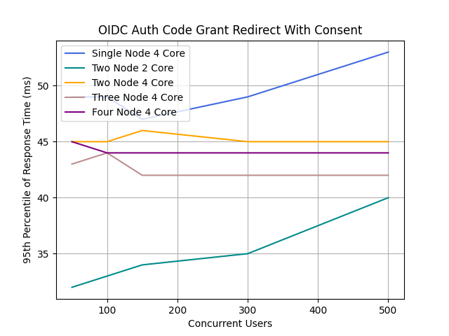

<ins> Concurrency: 50 - 3000 </ins>

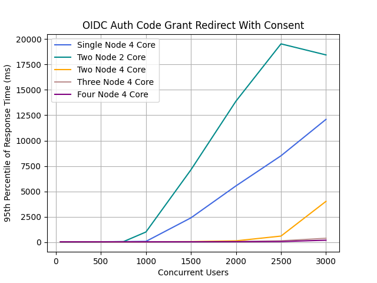

### 2. OIDC Auth Code Grant Redirect Without Consent

#### Obtain an access token and an id token using the OAuth 2.0 authorization code grant type.

Note: Response time is calculated for the user credentials submission request. A random delay is introduced before submitting the user credentials request to simulate a real user scenario.

Performance Comparison of Different Node Configurations with 95th Percentile of Response Time (ms)

Concurrent Users | Single Node 4 Core | Two Node 2 Core | Two Node 4 Core | Three Node 4 Core | Four Node 4 Core
-----------------|--------------------|------------------|------------------|--------------------|-------------------
50               | 106                | 70               | 101              | 92                 | 98
100              | 107                | 74               | 100              | 96                 | 97
150              | 92                 | 65               | 84               | 80                 | 83
300              | 96                 | 67               | 86               | 79                 | 82
500              | 105                | 87               | 86               | 80                 | 85
750              | 148                | 921              | 91               | 83                 | 85
1000             | 493                | 5649             | 99               | 85                 | 83
1500             | 7277               | 17629            | 148              | 102                | 96
2000             | 11773              | 31517            | 1907             | 149                | 117
2500             | 17021              | 39901            | 6997             | 589                | 510
3000             | 23389              | 51965            | 12141            | 3533               | 2618

<ins> Concurrency: 50 - 500 </ins>

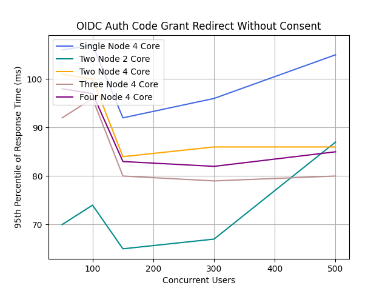

<ins> Concurrency: 50 - 3000 </ins>

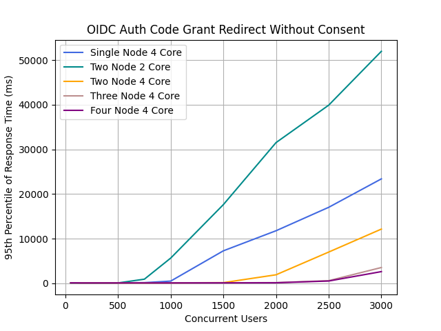

### 3. OIDC Auth Code Grant Redirect Without Consent Retrieving User Attributes

#### Obtain an access token and an id token using the OAuth 2.0 authorization code grant type. Retrieve country, email, first name and last name as user attributes.

Note: Response time is calculated for the user credentials submission request. A random delay is introduced before submitting the user credentials request to simulate a real user scenario.

Performance Comparison of Different Node Configurations with 95th Percentile of Response Time (ms)

Concurrent Users | Single Node 4 Core | Two Node 2 Core | Two Node 4 Core | Three Node 4 Core | Four Node 4 Core
-----------------|--------------------|------------------|------------------|--------------------|-------------------
50               | 93                 | 59               | 86               | 83                 | 87
100              | 91                 | 59               | 87               | 81                 | 84
150              | 91                 | 61               | 86               | 80                 | 84
300              | 95                 | 66               | 87               | 80                 | 82
500              | 107                | 89               | 87               | 80                 | 82
750              | 140                | 1818             | 92               | 82                 | 86
1000             | 723                | 5441             | 99               | 87                 | 85
1500             | 7357               | 20157            | 156              | 125                | 98
2000             | 12349              | 31933            | 2105             | 292                | 114
2500             | 17309              | 43389            | 6845             | 654                | 519
3000             | 23645              | 54141            | 16797            | 3377               | 2633

<ins> Concurrency: 50 - 500 </ins>

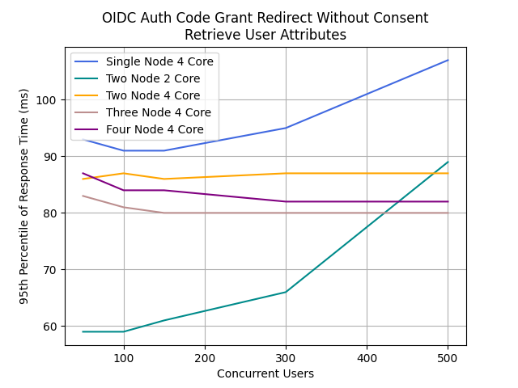

<ins> Concurrency: 50 - 3000 </ins>

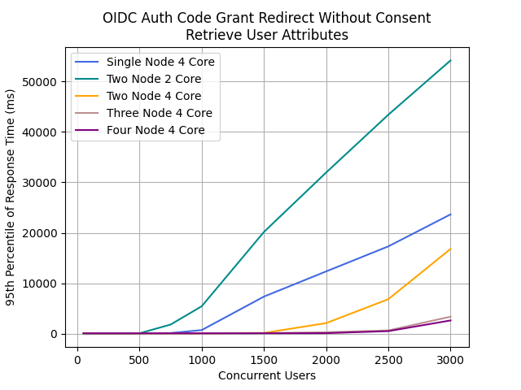

### 4. OIDC Auth Code Grant Redirect Without Consent Retrieving User Attributes Groups and Roles

#### Obtain an access token and an id token using the OAuth 2.0 authorization code grant type. Retrieve country, email, first name and last name as user attributes. Additionally retrieve groups and roles as well.

Note: Response time is calculated for the user credentials submission request. A random delay is introduced before submitting the user credentials request to simulate a real user scenario.

Performance Comparison of Different Node Configurations with 95th Percentile of Response Time (ms)

Concurrent Users | Single Node 4 Core | Two Node 2 Core | Two Node 4 Core | Three Node 4 Core | Four Node 4 Core
-----------------|--------------------|------------------|------------------|--------------------|-------------------
50               | 94                 | 60               | 87               | 81                 | 86
100              | 94                 | 59               | 87               | 80                 | 84
150              | 92                 | 59               | 86               | 80                 | 86
300              | 94                 | 64               | 85               | 82                 | 84
500              | 110                | 82               | 87               | 81                 | 86
750              | 253                | 189              | 91               | 83                 | 86
1000             | 463                | 7565             | 100              | 87                 | 85
1500             | 7757               | 22269            | 146              | 105                | 97
2000             | 11901              | 30301            | 400              | 151                | 115
2500             | 16637              | 39613            | 7229             | 639                | 524
3000             | 24605              | 46269            | 11661            | 3481               | 2647

<ins> Concurrency: 50 - 500 </ins>

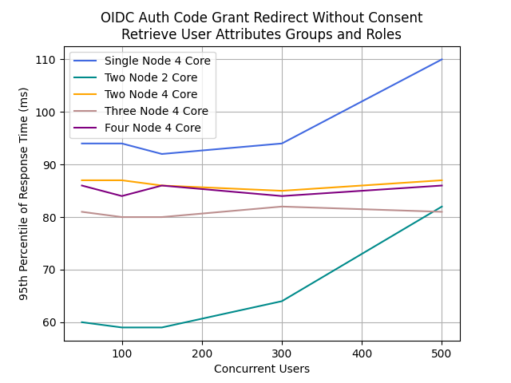

<ins> Concurrency: 50 - 3000 </ins>

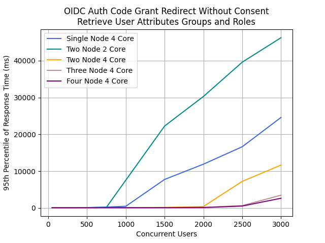

### 5. SAML2 SSO Redirect Binding

#### Obtain a SAML 2 assertion response using redirect binding.

Note: Response time is calculated for the user credentials submission request. A random delay is introduced before submitting the user credentials request to simulate a real user scenario.

Performance Comparison of Different Node Configurations with 95th Percentile of Response Time (ms)

Concurrent Users | Single Node 4 Core | Two Node 2 Core | Two Node 4 Core | Three Node 4 Core | Four Node 4 Core
-----------------|--------------------|------------------|------------------|--------------------|-------------------
50               | 46                 | 31               | 52               | 49                 | 54
100              | 46                 | 32               | 55               | 49                 | 53
150              | 45                 | 32               | 51               | 49                 | 52
300              | 46                 | 32               | 51               | 47                 | 51
500              | 49                 | 37               | 50               | 47                 | 51
750              | 54                 | 50               | 52               | 48                 | 51
1000             | 64                 | 179              | 55               | 49                 | 52
1500             | 1415               | 11135            | 62               | 53                 | 55
2000             | 4159               | 15039            | 85               | 60                 | 58
2500             | 7391               | 20607            | 187              | 79                 | 77
3000             | 10495              | 32383            | 3615             | 515                | 479

<ins> Concurrency: 50 - 500 </ins>

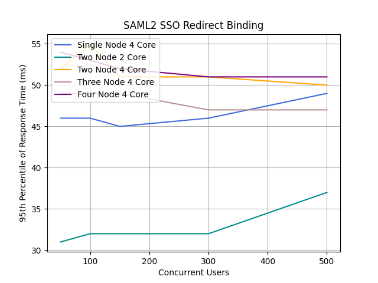

<ins> Concurrency: 50 - 3000 </ins>

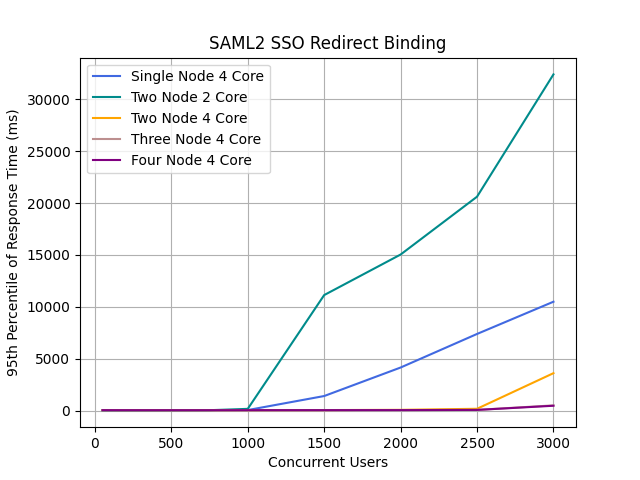

### 6. App Native Authentication

#### Obtain an access token and an id token using the app native authentication.

Note: Response time is calculated for the user credentials submission request. A random delay is introduced before submitting the user credentials request to simulate a real user scenario.

Performance Comparison of Different Node Configurations with 95th Percentile of Response Time (ms)

Concurrent Users | Single Node 4 Core | Two Node 2 Core | Two Node 4 Core | Three Node 4 Core | Four Node 4 Core
-----------------|--------------------|------------------|------------------|--------------------|-------------------
50               | 93                 | 60               | 86               | 82                 | 85
100              | 90                 | 59               | 86               | 82                 | 82
150              | 92                 | 60               | 83               | 79                 | 81
300              | 95                 | 64               | 89               | 79                 | 81
500              | 103                | 93               | 85               | 82                 | 81
750              | 147                | 1084             | 89               | 82                 | 81
1000             | 570                | 9422             | 101              | 86                 | 84
1500             | 6526               | 19166            | 249              | 106                | 92
2000             | 10750              | 23806            | 2074             | 152                | 112
2500             | 16094              | 47934            | 7966             | 686                | 514
3000             | 22142              | 51582            | 11422            | 6094               | 2542

<ins> Concurrency: 50 - 500 </ins>

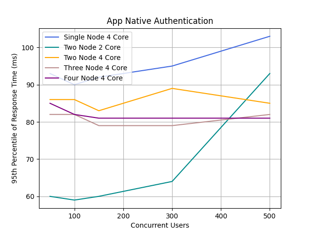

<ins> Concurrency: 50 - 3000 </ins>

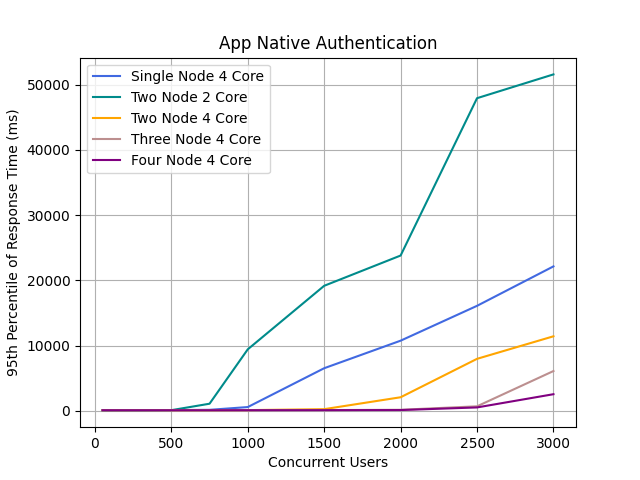

### 7. B2B OIDC Auth Code Grant Redirect With Consent

#### Obtain an access token and an id token in b2b flow.

Note: Response time is calculated for the user credentials submission request. A random delay is introduced before submitting the user credentials request to simulate a real user scenario.

Performance Comparison of Different Node Configurations with 95th Percentile of Response Time (ms)

Concurrent Users | Single Node 4 Core | Two Node 2 Core | Two Node 4 Core | Three Node 4 Core | Four Node 4 Core
-----------------|--------------------|------------------|------------------|--------------------|-------------------
50               | 116                | 146              | 157              | 163                | 201
100              | 110                | 141              | 158              | 160                | 193
150              | 94                 | 147              | 135              | 142                | 176
300              | 146               | 260              | 141              | 143                | 176
500              | 3004              | 10980            | 162              | 146                | 177
750              | 74044             | 109564           | 247              | 165                | 182
1000             | 66268             | 106172           | 2563             | 227                | 215
1500             | 0                 | 142908           | 25644            | 11940              | 444
2000             | 0                 | 133308           | 27868            | 18748              | 14676
2500             | 0                 | 0                | 31308            | 23532              | 18588
3000             | 0                 | 0                | 0                | 23772              | 19301

<ins> Concurrency: 50 - 500 </ins>

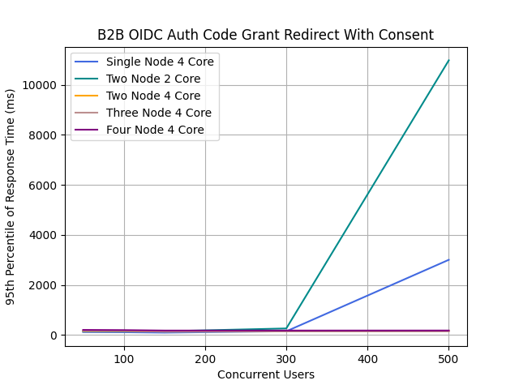

<ins> Concurrency: 50 - 3000 </ins>

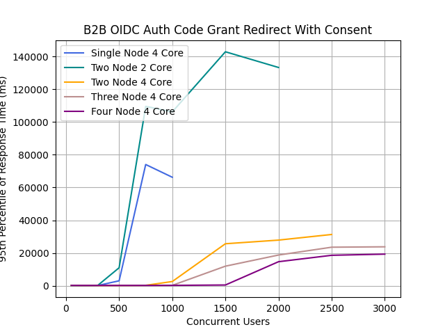

### 8. Token Exchange Grant Type

#### Obtain an access token and an id token using the token exchange grant type.

Performance Comparison of Different Node Configurations with 95th Percentile of Response Time (ms)

Concurrent Users | Single Node 4 Core | Two Node 2 Core | Two Node 4 Core | Three Node 4 Core | Four Node 4 Core
-----------------|--------------------|------------------|------------------|--------------------|-------------------
50               | 163                | 248              | 96               | 111                | 60
100              | 335                | 619              | 242              | 273                | 215
150              | 527                | 1007             | 425              | 451                | 385
300              | 1143               | 2207             | 967              | 1015               | 895
500              | 1967               | 3631             | 1759             | 1735               | 1607
750              | 2959               | 5471             | 2655             | 2591               | 2447
1000             | 3727               | 7771             | 3551             | 3423               | 3327
1500             | 4895               | 14079            | 6239             | 4831               | 4799
2000             | 6207               | 21247            | 9919             | 5759               | 5503
2500             | 7519               | 27903            | 12991            | 6883               | 6815
3000             | 8639               | 36863            | 16767            | 8771               | 8703

<ins> Concurrency: 50 - 500 </ins>

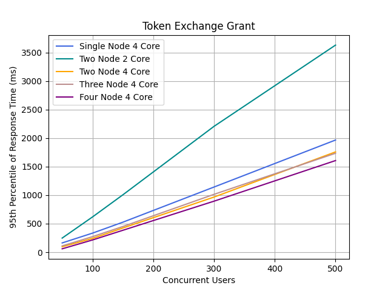

<ins> Concurrency: 50 - 3000 </ins>

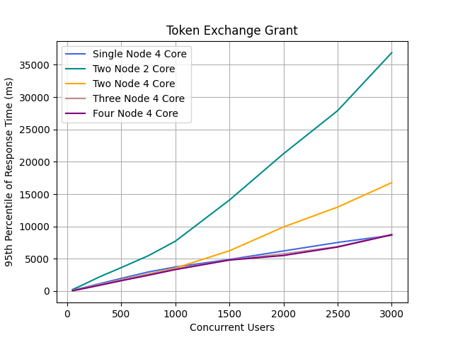

### 9. Client Credentials Grant Type

#### Obtain an access token using the OAuth 2.0 client credential grant type.

Performance Comparison of Different Node Configurations with 95th Percentile of Response Time (ms)

Concurrent Users | Single Node 4 Core | Two Node 2 Core | Two Node 4 Core | Three Node 4 Core | Four Node 4 Core
-----------------|--------------------|------------------|------------------|--------------------|-------------------
50               | 78                 | 170              | 67               | 41                 | 27
100              | 165                | 367              | 198              | 148                | 102
150              | 263                | 687              | 331              | 277                | 181
300              | 631                | 1623             | 855              | 647                | 413
500              | 1039               | 2575             | 1391             | 1175               | 771
750              | 1455               | 4047             | 2127             | 1783               | 1311
1000             | 1799               | 5407             | 2479             | 2175               | 1679
1500             | 2351               | 8383             | 3359             | 3183               | 2927
2000             | 2863               | 11967            | 4543             | 4191               | 3791
2500             | 3679               | 16383            | 6303             | 5247               | 4319
3000             | 4223               | 21887            | 7359             | 5631               | 5183

<ins> Concurrency: 50 - 500 </ins>

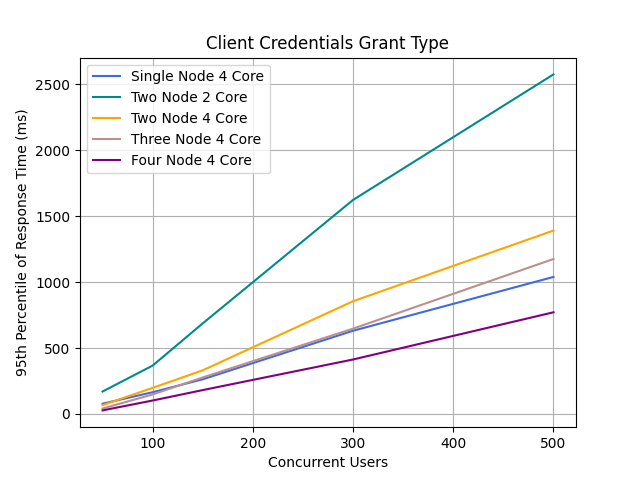

<ins> Concurrency: 50 - 3000 </ins>

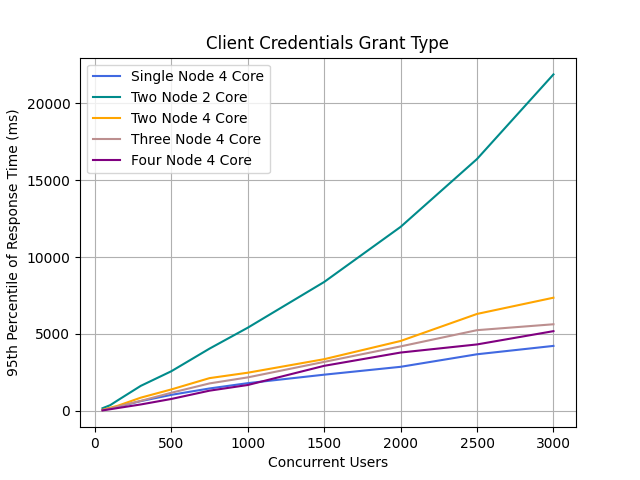

### 10. OIDC Password Grant Type

#### Obtain an access token and an id token using the OAuth 2.0 password grant type.

Performance Comparison of Different Node Configurations with 95th Percentile of Response Time (ms)

Concurrent Users | Single Node 4 Core | Two Node 2 Core | Two Node 4 Core | Three Node 4 Core | Four Node 4 Core
-----------------|--------------------|------------------|------------------|--------------------|-------------------
50               | 166                | 287              | 106              | 72                 | 44
100              | 313                | 643              | 265              | 231                | 159
150              | 501                | 983              | 455              | 427                | 367
300              | 1095               | 3711             | 1031             | 1011               | 907
500              | 1927               | 3919             | 1807             | 1743               | 1559
750              | 2703               | 5919             | 2767             | 2575               | 2495
1000             | 3391               | 9791             | 3631             | 3595               | 3407
1500             | 4895               | 13951            | 6559             | 6487               | 5983
2000             | 6079               | 22527            | 9855             | 9855               | 9151
2500             | 7423               | 27647            | 13503            | 13311              | 9983
3000             | 8447               | 37119            | 16895            | 16767              | 15551

<ins> Concurrency: 50 - 500 </ins>

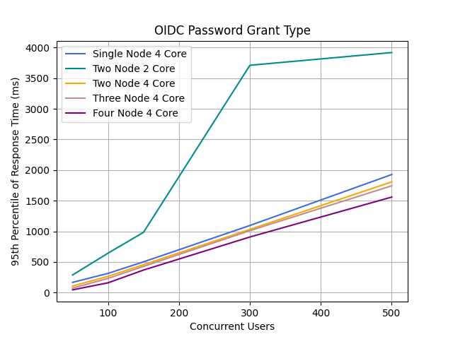

<ins> Concurrency: 50 - 3000 </ins>

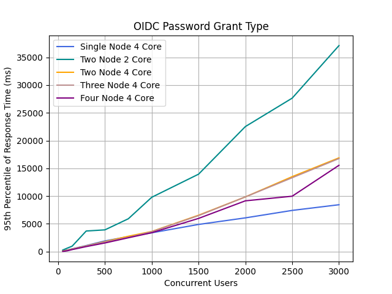
